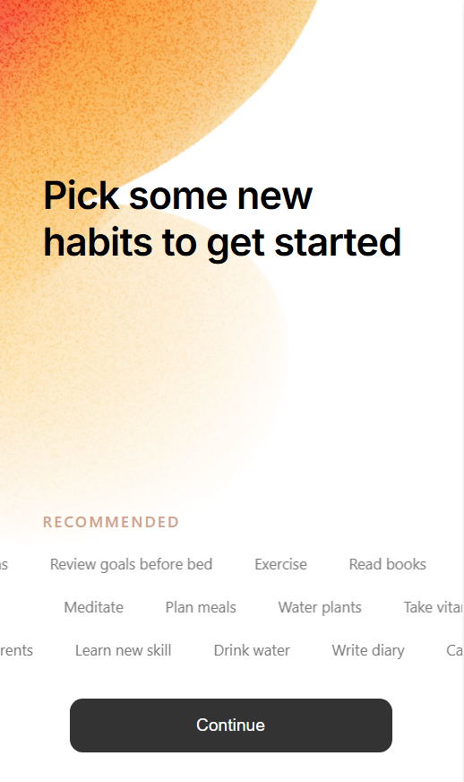

# SimpleTodo

A modern todo application built with React and TypeScript, based on a popular Figma design.

## Live Demo

**→ [View Application](https://zippy-yeot-23e82f.netlify.app/)**

## Application Preview



.png>)

## Original Design Reference

.png>)

**[View Original Figma File](https://www.figma.com/community/file/1006955130775844314/to-do-list-design)**

## Key Features

- Calendar Integration - Navigate tasks by date
- Task Categories - Work, Personal, House
- Smooth Animations - Custom CSS transitions
- Responsive Design - Mobile-first approach

## Technology Stack

- React 18 + TypeScript
- Pure CSS3 - No frameworks, custom styling
- React Transition Group - Component animations

## Installation

```bash
npm install
npm start
```

Built with React, TypeScript, and pure CSS
